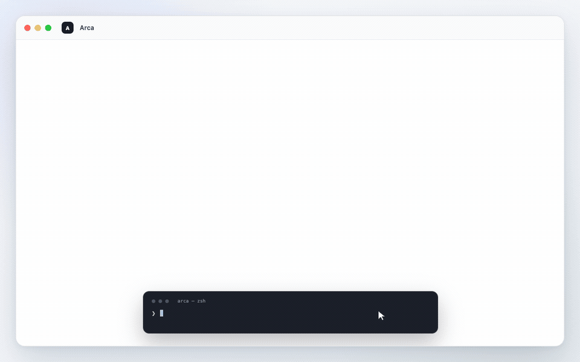

# Arca

[English](README.md) | [简体中文](README.zh-CN.md)

A portable, filesystem-native paper library for humans and agents. The folder
is the database; the CLI is only a reference client.

<p align="center">
  <a href="https://x66ccff.github.io/arca/">
    
  </a>
</p>

<p align="center">
  <strong><a href="https://x66ccff.github.io/arca/">Open the interactive demo →</a></strong>
</p>

## Quick start

```bash
git clone https://github.com/x66ccff/arca.git
cd arca

./arca init library
./arca --library library add 1706.03762
./arca --library library search "attention" --jsonl
./arca --library library citation-sync
./arca --library library visualize
```

Open `library/_index/paper-graph.html` in any browser. The generated graph is a
standalone offline HTML file.

`add` downloads arXiv metadata and the PDF by default. Add `--no-pdf` for a
metadata-only record.

## What it does

- Stores metadata, PDFs, notes, annotations, and relationships in ordinary folders.
- Imports papers directly from an arXiv ID or URL.
- Searches locally with stable text, JSON, or JSONL output.
- Links papers into a portable, editable knowledge graph.
- Builds an interactive citation and title/abstract-similarity graph.
- Uses atomic writes, validates PDFs, and moves removals to `.trash/`.

No database, server, account, or package manager is required. Local search,
notes, graph export, and visualization work offline; only arXiv import and
`citation-sync` need network access. Python 3.9+ is needed only for the bundled
CLI; any language can read and write the canonical JSON, JSONL, Markdown, and
PDF files directly.

## Example commands

```bash
# Query
./arca --library library list
./arca --library library get 1706.03762 --json
./arca --library library search "transformer" --jsonl
./arca --library library path 1706.03762

# Organize
./arca --library library update 1706.03762 --status key --add-tag attention
./arca --library library note 1706.03762 "Canonical Transformer paper."
./arca --library library annotate 1706.03762 --page 3 --quote "..." --comment "Core architecture"

# Connect papers
./arca --library library link 1810.04805 extends 1706.03762 --note "Bidirectional pre-training"
./arca --library library neighbors 1706.03762 --depth 2 --json
./arca --library library graph --format dot

# Visualize and validate
./arca --library library citation-sync
./arca --library library visualize --center 1706.03762 --depth 2
./arca --library library doctor --full

# Recoverable removal
./arca --library library remove 1706.03762 --yes
./arca --library library restore 1706.03762
```

Run `./arca --help` or `./arca COMMAND --help` for the complete CLI reference.

## Included demo

`examples/demo-library/` contains metadata for 20 real classic
machine-learning papers—from Word2Vec, GAN, ResNet, and PPO to Transformer,
BERT, DDPM, ViT, and CLIP. It contains no PDFs.

[Open the hosted interactive graph](https://x66ccff.github.io/arca/) without
installing anything, or generate the same standalone page locally:

```bash
./arca --library examples/demo-library list
./arca --library examples/demo-library search "residual" --jsonl
./arca --library examples/demo-library citation-sync
./arca --library examples/demo-library visualize /tmp/arca-demo.html --force
```

## Folder format

```text
library/
├── manifest.json
├── papers/<arxiv-id>/
│   ├── metadata.json
│   ├── paper.pdf
│   └── notes/
│       ├── summary.md
│       └── annotations.jsonl
├── graph/edges.jsonl
├── _index/                 # generated; safe to rebuild
├── .staging/               # transactional imports
└── .trash/                 # recoverable removals
```

Canonical data lives in `papers/`, `graph/`, and stored files. `_index/` is
generated acceleration and visualization state. See [SPEC.md](SPEC.md) and the
JSON schemas in [`schema/`](schema/) for the language-neutral format.

## Visualization

Solid directed edges are citations fetched from the free Semantic Scholar API.
Dashed, weaker edges are computed locally from titles and abstracts. Node size
tracks incoming citation count; newer papers are more opaque. A horizontal year
force draws older papers left and newer papers right while preserving citation
and topic forces. Zooming reveals progressively more labels, and clicking a
node highlights its neighbors. Visualization remains offline after
`citation-sync`.

## License

MIT. The bundled D3 distribution retains its own license. The demo redistributes
paper metadata only, not PDFs.
